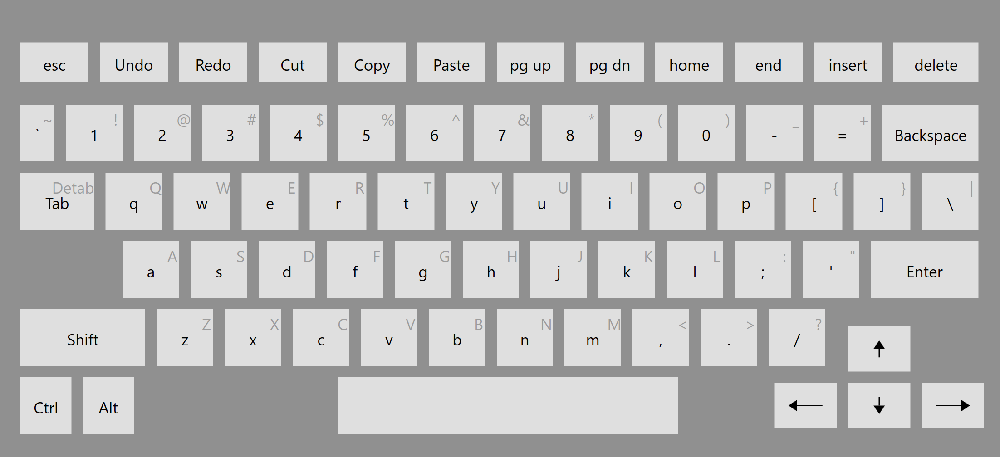

# Flickeyboard

A virtual keyboard with key flicks, swipe down on a key to enter a secondary character!

(TODO: change this to a gif or something)

Features:
- Secondary keys that can be typed by swiping on the key
- Shortcut keys for commonly used keyboard shortcuts
- Multi-touch support for fast typing
- Toggle-based control keys (shift, alt, ctrl, etc)

## Build instructions

In order to build this yourself, you need:
- Windows 10
- Visual Studio 2019
- F# 5.0 (idk if it works with 6.0)
- .NET 5.0
- WPF tools (via VS Installer)
- InputSimulatorPlus (via NuGet, if it doesn't get installed automatically)

## Known issues

Usage:
- Keyboard doesn't always stay on top when you first open it and then focus on another window. I have no clue how to fix this
	- The current workaround is to: focus on the other app, press a random key, and then focus on the other app again
- Holding down some control keys (arrows, backspace, etc) can cause the keyboard to lose focus
- The "redo" key does not work correctly with all applications, as some use Ctrl+Y (current option) and others use Ctrl+Shift+Z
- Keyboard is not treated as an overlay in Tablet Mode (so it will take up the entire screen)
- Mouse emulation isn't currently supported (afaik)

Compatability:
- Some apps don't accept control keys, mainly arrow keys and tab
- Some apps refuse to work with the keyboard at all, including:
	- Visual Studio 2019

## TODO

- Make window resizing more sane
- Figure out how to force the keyboard to be on top at all times (unless minimized)
- Add option to configure various keys
- Make a demo or something and put it in the README
- Make a windows installer and put out github releases